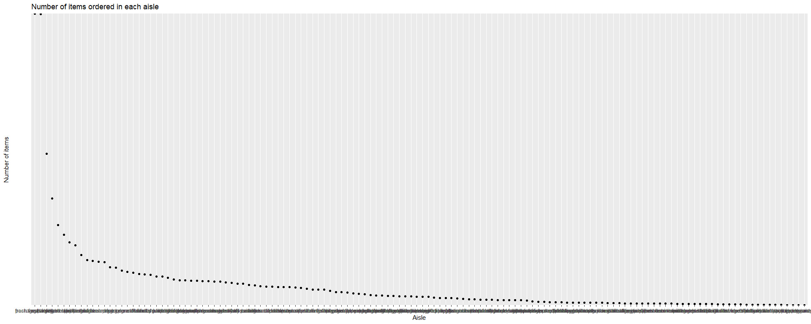

p8015\_hw3\_yx2507
================

# Problem 1

load the dataset

``` r
library(p8105.datasets)
data("instacart")
```

decription of the dataset \#\# 1 How many aisles are there, and which
aisles are the most items ordered from? There are 1384617 rows and 15
columns. there are aisle, 1384617

``` r
instacart%>%
  distinct(aisle)%>%
  nrow()
```

    ## [1] 134

``` r
instacart%>% 
  count(aisle)%>%
  arrange(desc(n))
```

    ## # A tibble: 134 x 2
    ##    aisle                              n
    ##    <chr>                          <int>
    ##  1 fresh vegetables              150609
    ##  2 fresh fruits                  150473
    ##  3 packaged vegetables fruits     78493
    ##  4 yogurt                         55240
    ##  5 packaged cheese                41699
    ##  6 water seltzer sparkling water  36617
    ##  7 milk                           32644
    ##  8 chips pretzels                 31269
    ##  9 soy lactosefree                26240
    ## 10 bread                          23635
    ## # ... with 124 more rows

There are 134 distinct aisles in the dataset and the most frequently
ordered is fresh vegetables which is ordered by 150609 times. \#\# 1.2
Make a plot that shows the number of items ordered in each aisle,
limiting this to aisles with more than 10000 items ordered. Arrange
aisles sensibly, and organize your plot so others can read it.

``` r
instacart%>%
  count(aisle)%>%
  mutate(aisle = fct_reorder(aisle, desc(n)))%>%
  filter(n>10000)%>%
  ggplot(aes(x = aisle, y = n))+
   scale_y_discrete(breaks = c(200000,20000, 2000, 200),labels=c("200000","20000", "2000", "200"), limits = c(10000,200000)) +
  geom_point(aes(color = aisle))+
  labs(
      title = "Number of items ordered in each aisle",
      x = "Aisle",
      y = "Number of items"
    ) +
theme(axis.text.x = element_text(angle = 70, hjust = 1))
```

<!-- --> \#\# 1.3 Make
a table showing the three most popular items in each of the aisles
“baking ingredients”, “dog food care”, and “packaged vegetables
fruits”. Include the number of times each item is ordered in your
table.

``` r
instacart %>% 
  filter(aisle %in% c('baking ingredients', 'dog food care', 'packaged vegetables fruits')) %>% 
  group_by(aisle, product_name)  %>% 
  count() %>% 
  group_by(aisle) %>%
  mutate(order_rank=min_rank(desc(n)))%>%
  filter(order_rank < 4)%>%
  select(aisle, product_name)%>%
   knitr::kable(
    col.names = c("Aisle", "Most popular item"), 
    format = 'html', 
    caption = "Table: The most popular item in three aisles"
  )
```

<table>

<caption>

Table: The most popular item in three aisles

</caption>

<thead>

<tr>

<th style="text-align:left;">

Aisle

</th>

<th style="text-align:left;">

Most popular item

</th>

</tr>

</thead>

<tbody>

<tr>

<td style="text-align:left;">

baking ingredients

</td>

<td style="text-align:left;">

Cane Sugar

</td>

</tr>

<tr>

<td style="text-align:left;">

baking ingredients

</td>

<td style="text-align:left;">

Light Brown Sugar

</td>

</tr>

<tr>

<td style="text-align:left;">

baking ingredients

</td>

<td style="text-align:left;">

Pure Baking Soda

</td>

</tr>

<tr>

<td style="text-align:left;">

dog food care

</td>

<td style="text-align:left;">

Organix Chicken & Brown Rice Recipe

</td>

</tr>

<tr>

<td style="text-align:left;">

dog food care

</td>

<td style="text-align:left;">

Small Dog Biscuits

</td>

</tr>

<tr>

<td style="text-align:left;">

dog food care

</td>

<td style="text-align:left;">

Snack Sticks Chicken & Rice Recipe Dog Treats

</td>

</tr>

<tr>

<td style="text-align:left;">

packaged vegetables fruits

</td>

<td style="text-align:left;">

Organic Baby Spinach

</td>

</tr>

<tr>

<td style="text-align:left;">

packaged vegetables fruits

</td>

<td style="text-align:left;">

Organic Blueberries

</td>

</tr>

<tr>

<td style="text-align:left;">

packaged vegetables fruits

</td>

<td style="text-align:left;">

Organic
Raspberries

</td>

</tr>

</tbody>

</table>

## 1.4 Make a table showing the mean hour of the day at which Pink Lady Apples and Coffee Ice Cream are ordered on each day of the week; format this table for human readers (i.e. produce a 2 x 7 table).

``` r
 instacart %>% 
  mutate(order_dow = factor(order_dow, labels = c("Sun", "Mon", "Tue", "Wed", "Thu", "Fri", "Sat"))) %>% 
  filter(product_name %in% c('Pink Lady Apples', "Coffee Ice Cream")) %>% 
  group_by(product_name, order_dow)%>%
  summarise(mean=mean(order_hour_of_day))%>%
  select(product_name,order_dow,mean)%>%
  pivot_wider(
    names_from = "order_dow",
    values_from = "mean"
  ) %>% 
knitr::kable( digits = 1，
  col.names = c("Product Name", "Sun", "Mon", "Tue", "Wed", "Thu", "Fri", "Sat"),
  caption = "Table of mean order hours for pink lady apples and coffee ice creams in each day ",
  format = 'html'
)
```

<table>

<caption>

Table of mean order hours for pink lady apples and coffee ice creams in
each day

</caption>

<thead>

<tr>

<th style="text-align:left;">

Product Name

</th>

<th style="text-align:right;">

Sun

</th>

<th style="text-align:right;">

Mon

</th>

<th style="text-align:right;">

Tue

</th>

<th style="text-align:right;">

Wed

</th>

<th style="text-align:right;">

Thu

</th>

<th style="text-align:right;">

Fri

</th>

<th style="text-align:right;">

Sat

</th>

</tr>

</thead>

<tbody>

<tr>

<td style="text-align:left;">

Coffee Ice Cream

</td>

<td style="text-align:right;">

13.8

</td>

<td style="text-align:right;">

14.3

</td>

<td style="text-align:right;">

15.4

</td>

<td style="text-align:right;">

15.3

</td>

<td style="text-align:right;">

15.2

</td>

<td style="text-align:right;">

12.3

</td>

<td style="text-align:right;">

13.8

</td>

</tr>

<tr>

<td style="text-align:left;">

Pink Lady Apples

</td>

<td style="text-align:right;">

13.4

</td>

<td style="text-align:right;">

11.4

</td>

<td style="text-align:right;">

11.7

</td>

<td style="text-align:right;">

14.2

</td>

<td style="text-align:right;">

11.6

</td>

<td style="text-align:right;">

12.8

</td>

<td style="text-align:right;">

11.9

</td>

</tr>

</tbody>

</table>

# prolem 2

load the dataset

``` r
library(p8105.datasets)
data("brfss_smart2010")
```

## 2.1

First, do some data cleaning: format the data to use appropriate
variable names; focus on the “Overall Health” topic include only
responses from “Excellent” to “Poor” organize responses as a factor
taking levels ordered from “Poor” to “Excellent”

``` r
health_data=
  brfss_smart2010 %>%
  janitor::clean_names()%>%
  select(-respid,-geo_location)%>%
  filter(topic %in% c("overall health"))%>%
  filter(response %in% c("excellent", "good","poor"))%>%
   mutate(response = fct_relevel(response, c("Excellent", "Very good", "Good", "Fair", "Poor")))
```

    ## Warning: Unknown levels in `f`: Excellent, Very good, Good, Fair, Poor
