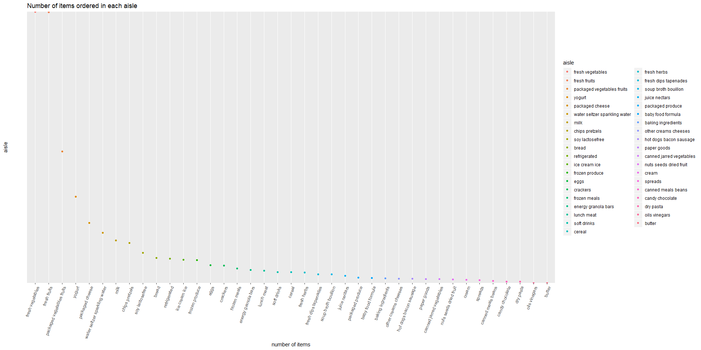
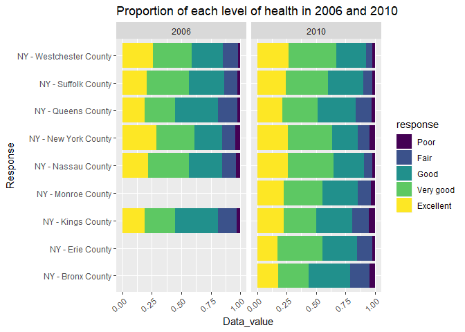
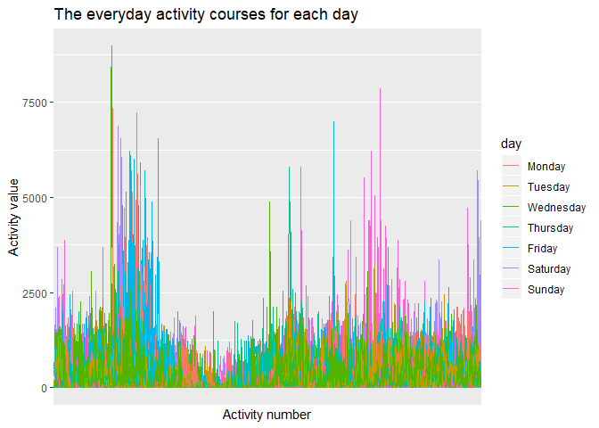

p8015\_hw3\_yx2507
================
Yuqing Xue
10/13/2019

# Problem 1

## 1.1Load the dataset

``` r
library(p8105.datasets)
data("instacart")
```

## 1.2 Description of the dataset

### How many aisles are there, and which aisles are the most items ordered from?

There are 1384617 rows and 15 columns.

In this dataset, key variables involved in the following questions
include `aisle` and `aisle_id`, which denote the names and identifiers
of distinct aisles, `product_name` and `product_id`, which denote names
and identifiers of distinct products (items), and `order_dow` and
`order_hour_of_day`, which denote the day of the week, and the hour of
the day that the order was placed, respectively. Other variables not
involved in this problem may also be of interest for other purposes.

### illustrate observation

Each observation (row) in this dataset denotes a product bought in an
order. For example, the first 5 rows in this dataset contain 15
variables. They are different products bought in order \#1 by the same
customer. The first product was Bulgarian Yogurt from the yogurt aisle,
dairy eggs department. It was bought on 10 a.m. Wednesday.

``` r
options(tibble.width = Inf) 
instacart[1:5, ]
```

    ## # A tibble: 5 x 15
    ##   order_id product_id add_to_cart_order reordered user_id eval_set
    ##      <int>      <int>             <int>     <int>   <int> <chr>   
    ## 1        1      49302                 1         1  112108 train   
    ## 2        1      11109                 2         1  112108 train   
    ## 3        1      10246                 3         0  112108 train   
    ## 4        1      49683                 4         0  112108 train   
    ## 5        1      43633                 5         1  112108 train   
    ##   order_number order_dow order_hour_of_day days_since_prior_order
    ##          <int>     <int>             <int>                  <int>
    ## 1            4         4                10                      9
    ## 2            4         4                10                      9
    ## 3            4         4                10                      9
    ## 4            4         4                10                      9
    ## 5            4         4                10                      9
    ##   product_name                                  aisle_id department_id
    ##   <chr>                                            <int>         <int>
    ## 1 Bulgarian Yogurt                                   120            16
    ## 2 Organic 4% Milk Fat Whole Milk Cottage Cheese      108            16
    ## 3 Organic Celery Hearts                               83             4
    ## 4 Cucumber Kirby                                      83             4
    ## 5 Lightly Smoked Sardines in Olive Oil                95            15
    ##   aisle                department  
    ##   <chr>                <chr>       
    ## 1 yogurt               dairy eggs  
    ## 2 other creams cheeses dairy eggs  
    ## 3 fresh vegetables     produce     
    ## 4 fresh vegetables     produce     
    ## 5 canned meat seafood  canned goods

``` r
instacart%>%
  distinct(aisle)%>%
  nrow()
```

    ## [1] 134

``` r
instacart%>% 
  count(aisle)%>%
  arrange(desc(n))
```

    ## # A tibble: 134 x 2
    ##    aisle                              n
    ##    <chr>                          <int>
    ##  1 fresh vegetables              150609
    ##  2 fresh fruits                  150473
    ##  3 packaged vegetables fruits     78493
    ##  4 yogurt                         55240
    ##  5 packaged cheese                41699
    ##  6 water seltzer sparkling water  36617
    ##  7 milk                           32644
    ##  8 chips pretzels                 31269
    ##  9 soy lactosefree                26240
    ## 10 bread                          23635
    ## # ... with 124 more rows

There are 134 distinct aisles in the dataset and the most frequently
ordered is fresh vegetables which is ordered by 150609 times, followed
by fresh fruits asile and packaged vegetables fruits
aisle.

## 1.2 Make a plot that shows the number of items ordered in each aisle, limiting this to aisles with more than 10000 items ordered. Arrange aisles sensibly, and organize your plot so others can read it.

``` r
instacart%>%
  count(aisle)%>%
  mutate(aisle = fct_reorder(aisle, desc(n)))%>%
  filter(n>10000)%>%
  ggplot(aes(x =  aisle, y =  n))+
   scale_y_discrete(breaks = c(200000,20000, 2000, 200),labels=c("200000","20000", "2000", "200"), limits = c(10000,200000)) +
  geom_point(aes(color = aisle))+
  labs(
      title = "Number of items ordered in each aisle",
      x = "number of items",
      y = "aisle"
    ) +
theme(axis.text.x = element_text(angle = 70, hjust = 1))
```

<!-- --> \#\# 1.3 Make
a table showing the three most popular items in each of the aisles
“baking ingredients”, “dog food care”, and “packaged vegetables
fruits”. Include the number of times each item is ordered in your
table. the top 3 popular items of baking ingredients aisle is cane sugar
for 336 times, light brown sugar for 499 times, pure baking soda for 387
times; Top 3 items in dog food care aisle are organix chicken & brown
rice recipe with 28 times sold, smalle dog biscuits for 26 times, snack
sticks chicken & rice recipe dog treats for 30 times; top 3 items in
packaged vegetable fruits are organic baby spinach for 9784, organic
blueberries for 4966 and organic raspberries for 5546 times.

``` r
instacart %>% 
  filter(aisle %in% c('baking ingredients', 'dog food care', 'packaged vegetables fruits')) %>% 
  group_by(aisle, product_name)  %>% 
  count() %>% 
  group_by(aisle) %>%
  mutate(order_rank=min_rank(desc(n)))%>%
  filter(order_rank < 4)%>%
  select(aisle, product_name, n)%>%
  arrange(desc(n))%>%
   knitr::kable(
    col.names = c("Aisle", "Most popular item","number of orders"), 
    format = 'html', 
    caption = "Table: The most popular item in three aisles"
  )
```

<table>

<caption>

Table: The most popular item in three aisles

</caption>

<thead>

<tr>

<th style="text-align:left;">

Aisle

</th>

<th style="text-align:left;">

Most popular item

</th>

<th style="text-align:right;">

number of orders

</th>

</tr>

</thead>

<tbody>

<tr>

<td style="text-align:left;">

packaged vegetables fruits

</td>

<td style="text-align:left;">

Organic Baby Spinach

</td>

<td style="text-align:right;">

9784

</td>

</tr>

<tr>

<td style="text-align:left;">

packaged vegetables fruits

</td>

<td style="text-align:left;">

Organic Raspberries

</td>

<td style="text-align:right;">

5546

</td>

</tr>

<tr>

<td style="text-align:left;">

packaged vegetables fruits

</td>

<td style="text-align:left;">

Organic Blueberries

</td>

<td style="text-align:right;">

4966

</td>

</tr>

<tr>

<td style="text-align:left;">

baking ingredients

</td>

<td style="text-align:left;">

Light Brown Sugar

</td>

<td style="text-align:right;">

499

</td>

</tr>

<tr>

<td style="text-align:left;">

baking ingredients

</td>

<td style="text-align:left;">

Pure Baking Soda

</td>

<td style="text-align:right;">

387

</td>

</tr>

<tr>

<td style="text-align:left;">

baking ingredients

</td>

<td style="text-align:left;">

Cane Sugar

</td>

<td style="text-align:right;">

336

</td>

</tr>

<tr>

<td style="text-align:left;">

dog food care

</td>

<td style="text-align:left;">

Snack Sticks Chicken & Rice Recipe Dog Treats

</td>

<td style="text-align:right;">

30

</td>

</tr>

<tr>

<td style="text-align:left;">

dog food care

</td>

<td style="text-align:left;">

Organix Chicken & Brown Rice Recipe

</td>

<td style="text-align:right;">

28

</td>

</tr>

<tr>

<td style="text-align:left;">

dog food care

</td>

<td style="text-align:left;">

Small Dog
Biscuits

</td>

<td style="text-align:right;">

26

</td>

</tr>

</tbody>

</table>

## 1.4 Make a table showing the mean hour of the day at which Pink Lady Apples and Coffee Ice Cream are ordered on each day of the week; format this table for human readers (i.e. produce a 2 x 7 table).

``` r
 instacart %>% 
  mutate(order_dow = factor(order_dow, labels = c("Sun", "Mon", "Tue", "Wed", "Thu", "Fri", "Sat"))) %>% 
  filter(product_name %in% c('Pink Lady Apples', "Coffee Ice Cream")) %>% 
  group_by(product_name, order_dow)%>%
  summarise(mean=mean(order_hour_of_day))%>%
  select(product_name,order_dow,mean)%>%
  pivot_wider(
    names_from = "order_dow",
    values_from = "mean"
  ) %>% 
knitr::kable( digits = 1，
  col.names = c("Product Name", "Sun", "Mon", "Tue", "Wed", "Thu", "Fri", "Sat"),
  caption = "Table of mean order hours for pink lady apples and coffee ice creams in each day ",
  format = 'html'
)
```

<table>

<caption>

Table of mean order hours for pink lady apples and coffee ice creams in
each day

</caption>

<thead>

<tr>

<th style="text-align:left;">

Product Name

</th>

<th style="text-align:right;">

Sun

</th>

<th style="text-align:right;">

Mon

</th>

<th style="text-align:right;">

Tue

</th>

<th style="text-align:right;">

Wed

</th>

<th style="text-align:right;">

Thu

</th>

<th style="text-align:right;">

Fri

</th>

<th style="text-align:right;">

Sat

</th>

</tr>

</thead>

<tbody>

<tr>

<td style="text-align:left;">

Coffee Ice Cream

</td>

<td style="text-align:right;">

13.8

</td>

<td style="text-align:right;">

14.3

</td>

<td style="text-align:right;">

15.4

</td>

<td style="text-align:right;">

15.3

</td>

<td style="text-align:right;">

15.2

</td>

<td style="text-align:right;">

12.3

</td>

<td style="text-align:right;">

13.8

</td>

</tr>

<tr>

<td style="text-align:left;">

Pink Lady Apples

</td>

<td style="text-align:right;">

13.4

</td>

<td style="text-align:right;">

11.4

</td>

<td style="text-align:right;">

11.7

</td>

<td style="text-align:right;">

14.2

</td>

<td style="text-align:right;">

11.6

</td>

<td style="text-align:right;">

12.8

</td>

<td style="text-align:right;">

11.9

</td>

</tr>

</tbody>

</table>

Mean hour of the day at which Pink Lady Apples and Coffee Ice Cream are
ordered follow different patterns. Coffee Ice Cream is on average
ordered during weekdays. While Pink Lady Apples are ordered on average
more on Sundays and Wednesday.

### Question 2.3

# prolem 2

load the dataset

``` r
library(p8105.datasets)
data("brfss_smart2010")
```

## 2.1

First, do some data cleaning: format the data to use appropriate
variable names; focus on the “Overall Health” topic include only
responses from “Excellent” to “Poor” organize responses as a factor
taking levels ordered from “Poor” to “Excellent”

``` r
health_data=
  brfss_smart2010%>%
  janitor::clean_names()%>%
  filter(topic %in% "Overall Health" )%>%
   mutate(response = forcats::fct_relevel(response, c("Excellent", "Very good", "Good", "Fair", "Poor")))

view(health_data)
```

## 2.2 In 2002, which states were observed at 7 or more locations? What about in 2010?

``` r
states_obs_2002=
  health_data%>%
  filter(year %in% "2002")%>%
  group_by(locationabbr)%>%
  count()%>%
  filter(n>7)%>%
  knitr::kable(
    col.names = c("States","Number of observed"),
    caption = "Table for states which were observed at 7 or more locations in 2002"
  )

## view table
states_obs_2002
```

| States | Number of observed |
| :----- | -----------------: |
| AZ     |                 10 |
| CO     |                 20 |
| CT     |                 35 |
| DE     |                 15 |
| FL     |                 35 |
| GA     |                 15 |
| HI     |                 20 |
| ID     |                 10 |
| IL     |                 15 |
| IN     |                 10 |
| KS     |                 15 |
| LA     |                 15 |
| MA     |                 40 |
| MD     |                 30 |
| ME     |                 10 |
| MI     |                 20 |
| MN     |                 20 |
| MO     |                 10 |
| NC     |                 35 |
| NE     |                 15 |
| NH     |                 25 |
| NJ     |                 40 |
| NV     |                 10 |
| NY     |                 25 |
| OH     |                 20 |
| OK     |                 15 |
| OR     |                 15 |
| PA     |                 50 |
| RI     |                 20 |
| SC     |                 15 |
| SD     |                 10 |
| TN     |                 10 |
| TX     |                 10 |
| UT     |                 25 |
| VT     |                 15 |
| WA     |                 20 |

Table for states which were observed at 7 or more locations in 2002

``` r
states_obs7_2010=
  health_data%>%
  filter(year %in% "2010")%>%
  group_by(locationabbr) %>%
  count()%>%
  filter(n>7)%>%
  knitr::kable(
     col.names = c("States","number of observed"),
    caption = "Table for states which were observed at 7 or more locations in 2010"
  )

states_obs7_2010
```

| States | number of observed |
| :----- | -----------------: |
| AL     |                 15 |
| AR     |                 15 |
| AZ     |                 15 |
| CA     |                 60 |
| CO     |                 35 |
| CT     |                 25 |
| DE     |                 15 |
| FL     |                205 |
| GA     |                 20 |
| HI     |                 20 |
| IA     |                 10 |
| ID     |                 30 |
| IL     |                 10 |
| IN     |                 15 |
| KS     |                 20 |
| LA     |                 25 |
| MA     |                 45 |
| MD     |                 60 |
| ME     |                 30 |
| MI     |                 20 |
| MN     |                 25 |
| MO     |                 15 |
| MS     |                 10 |
| MT     |                 15 |
| NC     |                 60 |
| ND     |                 15 |
| NE     |                 50 |
| NH     |                 25 |
| NJ     |                 95 |
| NM     |                 30 |
| NV     |                 10 |
| NY     |                 45 |
| OH     |                 40 |
| OK     |                 15 |
| OR     |                 20 |
| PA     |                 35 |
| RI     |                 25 |
| SC     |                 35 |
| SD     |                 10 |
| TN     |                 25 |
| TX     |                 80 |
| UT     |                 30 |
| VT     |                 30 |
| WA     |                 50 |
| WY     |                 10 |

Table for states which were observed at 7 or more locations in 2010

In 2002 and 2010, states like AL and others states which were observed
at 7 or more locations are all showed in the table Differently, in 2002,
NJ was the stated observed the most time which is 40 while in 2010, FL
was oberseved 205 locations.

## 2.3

Construct a dataset that is limited to Excellent responses, and
contains, year, state, and a variable that averages the data\_value
across locations within a state.

Make a “spaghetti” plot of this average value over time within a state
(that is, make a plot showing a line for each state across years – the
geom\_line geometry and group aesthetic will help).

``` r
 health_subdata = 
  health_data%>%
  filter(response %in% "Excellent")%>%
  group_by(year, locationabbr)%>%
  summarize(mean_datavalue=mean(data_value, na.rm = TRUE))%>%
  select(year, locationabbr, mean_datavalue)
  
  ## make a plot
plot_average = 
  health_subdata%>%
ggplot(aes(x=year, y=mean_datavalue, color = locationabbr))+
  geom_line(alpha = .5)+
  labs(
      title = "Average data value from 2002 to 2010",
      x = "Year",
      y = "Mean data value",
      color = 'States'
    ) 

plot_average
```

<!-- -->

The spagetti plots shows the chage of average data value from 2002 to
2010 for each states. In general, AK,AL have larger mean data\_value
across the years.For the majority of states, number of locations varied
between 1 and 8 and stayed almost stable. For some other states such as
FL, NJ and TX, number of locations witnessed rapid change. Most
noticeably, the number of locations in FL changed rapidly in 2007, 2008
and
2010.

## 2.5 Make a two-panel plot showing, for the years 2006, and 2010, distribution of data\_value for responses (“Poor” to “Excellent”) among locations in NY State

``` r
plot_data=
health_data%>%
  filter(response %in% c("Poor","Fair","Good", "Very good","Excellent" ), year %in% c("2006","2010"), locationabbr == "NY")%>%
  select(year, response, locationabbr, data_value)%>%
    ggplot(aes(x=response, y=data_value, Color=response))+
  geom_boxplot()+
  facet_grid(. ~ year)
    
  plot_data
```

<!-- --> As
is shown in the two-panel boxplot above, in 2006 and 2010, in general,
excellent, very good, good level of health have larger data\_value. This
trend is stable across these two years.This plot also helps us identify
the distribution within each level. For example, in excellent level in
2006, more people have lower data\_value, the distribution is right
skewed.

# Problem 2

# Problem 3

Load, tidy, and otherwise wrangle the data. Your final dataset should
include all originally observed variables and values; have useful
variable names; include a weekday vs weekend variable; and encode data
with reasonable variable classes. Describe the resulting dataset
(e.g. what variables exist, how many observations, etc).

``` r
data_activity= read_csv("./data/accel_data.csv")%>%
  janitor::clean_names()%>%
  mutate(day= factor(day, levels = c("Monday", "Tuesday", "Wednesday", "Thursday", "Friday", "Saturday", "Sunday")),
         weekday = day %in% c("Monday","Tuesday","Wednesday","Thursday","Friday")
                              )%>%
  pivot_longer(
    activity_1:activity_1440,
     names_to = "activity_number",
    values_to = "activity_value"
  )%>%
  select(week, day_id, weekday, day,activity_number,activity_value, everything())
```

    ## Parsed with column specification:
    ## cols(
    ##   .default = col_double(),
    ##   day = col_character()
    ## )

    ## See spec(...) for full column specifications.

there are 50400 rows and 6 columns. Key varaibles are the number of
week, day and whether it is weekday or weekends, also activity\_n is the
value of each
test.

## 3.2 Using your tidied dataset, aggregate accross minutes to create a total activity variable for each day, and create a table showing these totals. Are any trends apparent?

``` r
data_activity_everyday = 
data_activity%>%
  group_by(week,day)%>%
  mutate(sum_activity = sum(activity_value))%>%
  distinct(sum_activity)%>%
pivot_wider(
  names_from = day,
  values_from = sum_activity
  
) %>%
  select(week,Monday, Tuesday, Wednesday, Thursday, Friday, Saturday,Sunday)%>%
  knitr::kable(
    caption = "overall activity value for each day"
  )
  

data_activity_everyday
```

| week |    Monday |  Tuesday | Wednesday | Thursday |   Friday | Saturday | Sunday |
| ---: | --------: | -------: | --------: | -------: | -------: | -------: | -----: |
|    1 |  78828.07 | 307094.2 |    340115 | 355923.6 | 480542.6 |   376254 | 631105 |
|    2 | 295431.00 | 423245.0 |    440962 | 474048.0 | 568839.0 |   607175 | 422018 |
|    3 | 685910.00 | 381507.0 |    468869 | 371230.0 | 467420.0 |   382928 | 467052 |
|    4 | 409450.00 | 319568.0 |    434460 | 340291.0 | 154049.0 |     1440 | 260617 |
|    5 | 389080.00 | 367824.0 |    445366 | 549658.0 | 620860.0 |     1440 | 138421 |

overall activity value for each day

The overall data\_Value for everyday is listed in the table above, with
its week number and day\_id. There is no specific trend for the change.
The value is going up and down.

## 3.3 make single panle to show 24-hr trend for each day

``` r
plot_value=
data_activity%>%
  ggplot(aes(x=activity_number, y=activity_value, color= week))+
           geom_point()+
  facet_grid(.~ day_id)

plot_value
```

<!-- -->
